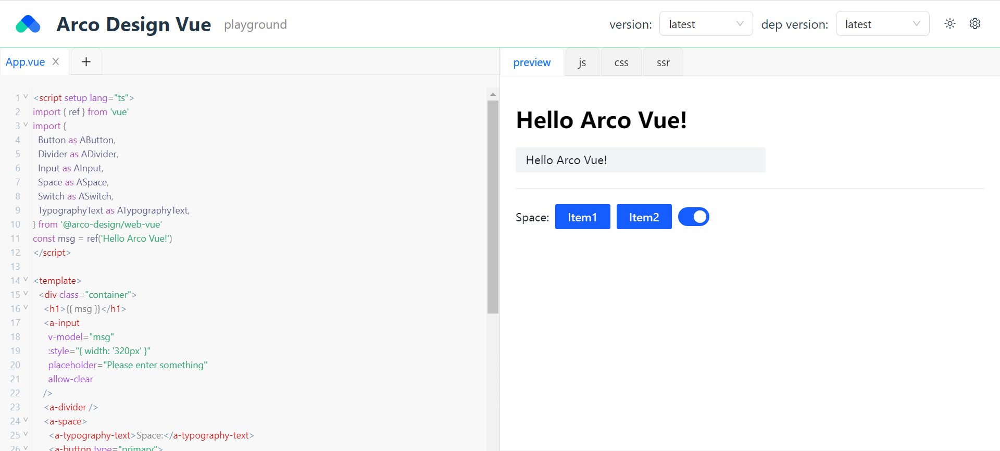

# Example Arco Design Vue

## 1. 新建一个 React 项目
使用 `vite` 新建一个 `React` 项目

```shell
pnpm create vite
```

```shell
√ Project name: ... demo-arco
√ Select a framework: » React
√ Select a variant: » TypeScript

Scaffolding project in C:\Users\baiwusanyu\ep\demo-arco...

Done. Now run:

  cd demo-arco
  pnpm install
  pnpm run dev
```
## 2. 导入样式
安装好 `ui-playground` 后，在入口文件导入样式。

```typescript jsx
import ReactDOM from 'react-dom/client'
import App from './views/App'
import '@ui-playground/theme/index'
import '@ui-playground/theme'
ReactDOM.createRoot(document.getElementById('root') as HTMLElement).render(
  <App />,
)
```

## 3. 编写入口文件与配置脚本
编写入口文件 `App.vue`

```html
<script setup lang="ts">
    import { ref } from 'vue'
    import {
        Button as AButton,
        Divider as ADivider,
        Input as AInput,
        Space as ASpace,
        Switch as ASwitch,
        TypographyText as ATypographyText,
    } from '@arco-design/web-vue'
    const msg = ref('Hello Arco Vue!')
</script>
<template>
    <div class="container">
        <h1>{{ msg }}</h1>
        <a-input
                v-model="msg"
                :style="{ width: '320px' }"
                placeholder="Please enter something"
                allow-clear
        />
        <a-divider />
        <a-space>
            <a-typography-text>Space:</a-typography-text>
            <a-button type="primary">
                Item1
            </a-button>
            <a-button type="primary">
                Item2
            </a-button>
            <a-switch default-checked />
        </a-space>
    </div>
</template>
```

编写配置脚本，对 `ui-playground` 进行设置。

```typescript

import { getPlayPreset } from 'ui-playground'
// @ts-expect-error 加载demo模板
import demoArcoMain from './demo-arco-main.vue?raw'

export const demoArco = () => {
  const playConfig = getPlayPreset('vue')
  playConfig.headerOption.useVersion = true
  playConfig.headerOption.uiVersionLink = 'https://data.jsdelivr.com/v1/package/npm/@arco-design/web-vue'
  playConfig.headerOption.uiMinVersion = '2.2.8'
  playConfig.headerOption.logo = 'https://avatars.githubusercontent.com/u/64576149?s=200&v=4'
  playConfig.headerOption.title = 'Arco Design Vue'
  playConfig.headerOption.homePage = 'https://arco.design/'
  playConfig.headerOption.cdnSet = (
    link: string,
    pkgName: string,
    version: string,
    indexPath: string,
  ) => {
    return `${link}${pkgName}@${version}${indexPath}`
  }
  playConfig.importMap.push(
    {
      name: '@arco-design/web-vue/css',
      pkgName: '@arco-design/web-vue',
      indexPath: '/dist/arco.css',
      type: 'css',
    },
    {
      name: '@arco-design/web-vue',
      pkgName: '@arco-design/web-vue',
      indexPath: '/es/index.js',
      type: 'ui',
    },
    {
      name: '@arco-design/web-vue/es/icon',
      pkgName: '@arco-design/web-vue/es/icon',
      indexPath: '/es/icon/index.js',
      type: 'ui',
    },
    {
      name: '@arco-design/web-vue/',
      pkgName: '@arco-design/web-vue/',
      indexPath: '/es/index.js',
      type: 'ui',
    },
    {
      name: 'resize-observer-polyfill',
      pkgName: 'resize-observer-polyfill',
      indexPath: '',
      cdnLink: 'https://cdn.skypack.dev/resize-observer-polyfill',
      type: 'other',
    },
    {
      name: 'compute-scroll-into-view',
      pkgName: 'compute-scroll-into-view',
      indexPath: '',
      cdnLink: 'https://cdn.skypack.dev/compute-scroll-into-view',
      type: 'other',
    },
    {
      name: 'scroll-into-view-if-needed',
      pkgName: 'scroll-into-view-if-needed',
      indexPath: '',
      cdnLink: 'https://cdn.skypack.dev/scroll-into-view-if-needed',
      type: 'other',
    },
    {
      name: 'b-tween',
      pkgName: 'b-tween',
      indexPath: '',
      cdnLink: 'https://cdn.skypack.dev/b-tween',
      type: 'other',
    },
    {
      name: 'b-validate',
      pkgName: 'b-validate',
      indexPath: '',
      cdnLink: 'https://cdn.skypack.dev/b-validate',
      type: 'other',
    },
    {
      name: 'number-precision',
      pkgName: 'number-precision',
      indexPath: '',
      cdnLink: 'https://cdn.skypack.dev/number-precision',
      type: 'other',
    },
    {
      name: 'dayjs',
      pkgName: 'dayjs',
      indexPath: '',
      cdnLink: 'https://cdn.skypack.dev/dayjs@v1.11.6',
      type: 'other',
    },
    {
      name: 'dayjs/plugin/customParseFormat',
      pkgName: 'dayjs/plugin/customParseFormat',
      indexPath: '',
      cdnLink: 'https://cdn.skypack.dev/dayjs@v1.11.6/plugin/customParseFormat.js',
      type: 'other',
    },
    {
      name: 'dayjs/plugin/isBetween',
      pkgName: 'dayjs/plugin/isBetween',
      indexPath: '',
      cdnLink: 'https://cdn.skypack.dev/dayjs@v1.11.6/plugin/isBetween.js',
      type: 'other',
    },
    {
      name: 'dayjs/plugin/weekOfYear',
      pkgName: 'dayjs/plugin/weekOfYear',
      indexPath: '',
      cdnLink: 'https://cdn.skypack.dev/dayjs@v1.11.6/plugin/weekOfYear.js',
      type: 'other',
    },
    {
      name: 'dayjs/plugin/advancedFormat',
      pkgName: 'dayjs/plugin/advancedFormat',
      indexPath: '',
      cdnLink: 'https://cdn.skypack.dev/dayjs@v1.11.6/plugin/advancedFormat.js',
      type: 'other',
    },
    {
      name: 'dayjs/plugin/weekYear',
      pkgName: 'dayjs/plugin/weekYear',
      indexPath: '',
      cdnLink: 'https://cdn.skypack.dev/dayjs@v1.11.6/plugin/weekYear.js',
      type: 'other',
    },
    {
      name: 'dayjs/plugin/quarterOfYear',
      pkgName: 'dayjs/plugin/quarterOfYear',
      indexPath: '',
      cdnLink: 'https://cdn.skypack.dev/dayjs@v1.11.6/plugin/quarterOfYear.js',
      type: 'other',
    },
    {
      name: 'dayjs/locale/zh-cn',
      pkgName: 'dayjs/locale/zh-cn',
      indexPath: '',
      cdnLink: 'https://cdn.skypack.dev/dayjs@v1.11.6/locale/zh-cn.js',
      type: 'other',
    },

  )
  playConfig.mainFile.code = demoArcoMain
  return playConfig
}
```

:::Tip
`dayjs` 在 `v1.11.6`以上，从浏览器通过 `CDN` ( `cdn.skypack.dev` )直接导入会报错，一定要注意必要的依赖版本
:::

## 4. 在组件中使用
你可以在组件( `e.g. App.tsx` )中直接导入组件 `<PlayGround/>` ,并传入配置，最终生成
`playground`

```typescript jsx
import { PlayGround } from 'ui-playground'
import { demoArco } from '../demo-arco'
const playConfig = demoArco()
playConfig.useUno = false
playConfig.isSSR = false
const App = () => {
  return (
    <div className="App">
      <PlayGround config={playConfig} />
    </div>
  )
}
export default App
```