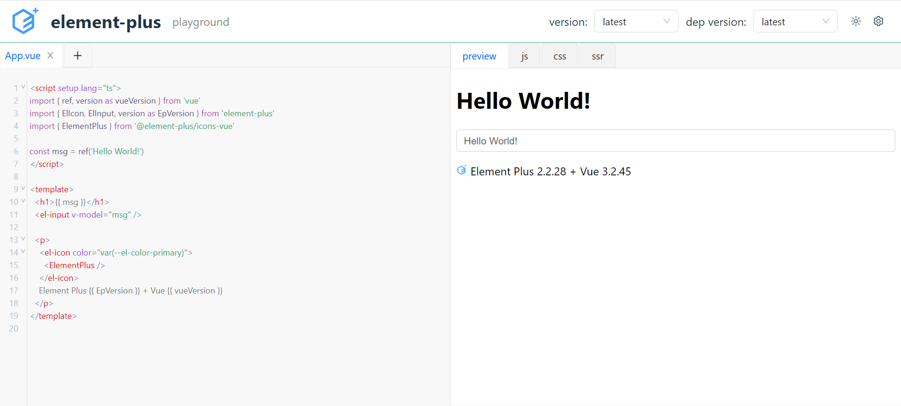

# 示例 Element Plus
[源码链接](https://github.com/baiwusanyu-c/ui-playground/tree/master/demo/demo-ep)



## 1. 新建一个 React 项目
使用 `vite` 新建一个 `React` 项目

```shell
pnpm create vite
```

```shell
√ Project name: ... demo-ep
√ Select a framework: » React
√ Select a variant: » TypeScript

Scaffolding project in C:\Users\baiwusanyu\ep\demo-ep...

Done. Now run:

  cd demo-ep
  pnpm install
  pnpm run dev
```
## 2. 导入样式
安装好 `ui-playground` 后，在入口文件导入样式。

```typescript jsx

import ReactDOM from 'react-dom/client'
import App from './views/App'
import '@ui-playground/theme/index'
import '@ui-playground/theme'
ReactDOM.createRoot(document.getElementById('root') as HTMLElement).render(
  <App />,
)
```

## 3. 编写入口文件与配置脚本
编写入口文件 `App.vue`

```html
<script setup lang="ts">
import { ref, version as vueVersion } from 'vue'
import { ElIcon, ElInput, version as EpVersion } from 'element-plus'
import { ElementPlus } from '@element-plus/icons-vue'
const msg = ref('Hello World!')
</script>

<template>
  <h1>{{ msg }}</h1>
  <el-input v-model="msg" />

  <p>
    <el-icon color="var(--el-color-primary)">
      <ElementPlus />
    </el-icon>
    Element Plus {{ EpVersion }} + Vue {{ vueVersion }}
  </p>
</template>
```

编写配置脚本，对 `ui-playground` 进行设置。

```typescript
import { getPlayPreset } from 'ui-playground'
import demoEpMain from './demo-ep-main.vue?raw'

export const demoEp = () => {
  const playConfig = getPlayPreset('vue')
  playConfig.headerOption.useVersion = true
  playConfig.headerOption.uiVersionLink = 'https://data.jsdelivr.com/v1/package/npm/element-plus'
  playConfig.headerOption.uiMinVersion = '2.2.8'
  playConfig.headerOption.logo = 'https://avatars.githubusercontent.com/u/68583457?s=200&v=4'
  playConfig.headerOption.title = 'element-plus'
  playConfig.headerOption.cdnSet = (
    link: string,
    pkgName: string,
    version: string,
    indexPath: string,
  ) => {
    return `${link}${pkgName}@${version}${indexPath}`
  }
  playConfig.importMap.push({
    name: 'element-plus',
    pkgName: 'element-plus',
    indexPath: '/dist/index.full.min.mjs',
    type: 'ui',
  },
  {
    name: '@element-plus/icons-vue',
    pkgName: '@element-plus/icons-vue',
    indexPath: '/dist/index.min.js',
    cdnLink: `${jsdelivrLink}/@element-plus/icons-vue@2/dist/index.min.js`,
    type: 'other',
  },
  {
    name: '@element-plus/css',
    pkgName: 'element-plus',
    indexPath: '/dist/index.css',
    type: 'css',
  },
  )
  playConfig.mainFile.code = demoEpMain
  return playConfig
}
```

## 4. 在组件中使用
你可以在组件( `e.g. App.tsx` )中直接导入组件 `<PlayGround/>` ,并传入配置，最终生成
`playground`

```typescript jsx
import { PlayGround } from 'ui-playground'
import { demoEp } from '../demo-ep'
const playConfig = demoEp()
playConfig.useUno = false
playConfig.isSSR = false
const App = () => {
  return (
    <div className="App">
      <PlayGround config={playConfig} />
    </div>
  )
}
export default App
```