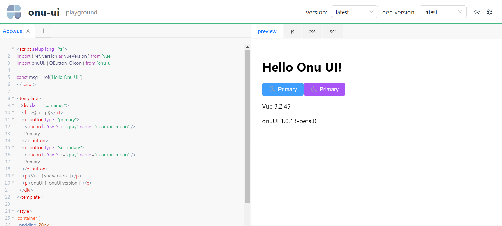

# Example Onu UI

## 1. 新建一个 React 项目
使用 vite 新建一个 React 项目

```shell
pnpm create vite
```

```shell
√ Project name: ... demo-onu
√ Select a framework: » React
√ Select a variant: » TypeScript

Scaffolding project in C:\Users\baiwusanyu\ep\demo-onu...

Done. Now run:

  cd demo-onu
  pnpm install
  pnpm run dev
```
## 2. 导入样式
安装好 `ui-playground` 后，在入口文件导入样式。

```typescript jsx

import ReactDOM from 'react-dom/client'
import App from './views/App'
import '@ui-playground/theme/index'
import '@ui-playground/theme'
ReactDOM.createRoot(document.getElementById('root') as HTMLElement).render(
  <App />,
)
```

## 3. 编写入口文件与配置脚本
编写入口文件 `App.vue`

```html
<script setup lang="ts">
    import { ref, version as vueVersion } from 'vue'
    import onuUI, { OButton, OIcon } from 'onu-ui'
    const msg = ref('Hello Onu UI!')
</script>

<template>
    <div class="container">
        <h1>{{ msg }}</h1>
        <o-button type="primary">
            <o-icon h-5 w-5 o="gray" name="i-carbon-moon" />
            Primary
        </o-button>
        <o-button type="secondary">
            <o-icon h-5 w-5 o="gray" name="i-carbon-moon" />
            Primary
        </o-button>
        <p>Vue {{ vueVersion }}</p>
        <p>onuUI {{ onuUI.version }}</p>
    </div>
</template>
```

编写配置脚本，对 `ui-playground` 进行设置。

```typescript
import { getPlayPreset } from 'ui-playground'
import { compilerUNOCSS } from '../compiler-inject-unocss'
// @ts-expect-error 加载demo模板
import demoEpMain from './demo-onu-main.vue?raw'

// 最佳实践demo
export const demoOnu = () => {
  const playConfig = getPlayPreset('vue')
  playConfig.headerOption.useVersion = true
  playConfig.headerOption.uiVersionLink = 'https://data.jsdelivr.com/v1/package/npm/onu-ui'
  playConfig.headerOption.uiMinVersion = '1.0.10'
  playConfig.headerOption.logo = 'https://onu.zyob.top/logo.png'
  playConfig.headerOption.title = 'onu-ui'
  playConfig.headerOption.cdnSet = (
    link: string,
    pkgName: string,
    version: string,
    indexPath: string,
  ) => {
    return `${link}${pkgName}@${version}${indexPath}`
  }
  playConfig.importMap.push({
      name: 'onu-ui',
      pkgName: 'onu-ui',
      indexPath: '/dist/onu-ui.js',
      type: 'ui',
    },
    {
      name: 'onu-ui/css',
      pkgName: 'onu-ui',
      indexPath: '/dist/style.css',
      cdnLink: 'https://cdn.jsdelivr.net/npm/onu-ui@latest/dist/style.css',
      type: 'css',
    },
  )
  playConfig.mainFile.code = demoEpMain
  playConfig.hooks.sandBoxMounted = (frame: HTMLIFrameElement) => {
    compilerUNOCSS(frame)
  }
  return playConfig
}

```

:::Tip
`Onu UI` 是一个基于 `unocss` 的组件库，它包涵有自己的`unocss`预设同时也适用了 `iconify` 的图标，
我们需要在上层的容器项目中根据其预设对 `ui-playground` 的沙盒 `iframe` 的元素进行解析，因此这里使用了
钩子函数 `hooks.sandBoxMounted`, 在元素生成后，使用 unocss 进行样式解析，
再将结果注入到`ui-playground` 的沙盒 `iframe`。
( See: [compilerUNOCSS](TODO), [evaluateUserConfig](TODO) )
:::

## 4. 在组件中使用
你可以在组件( `e.g. App.tsx` )中直接导入组件 `<PlayGround/>` ,并传入配置，最终生成
`playground`

```typescript jsx

import '../assets/scss/App.css'
import { PlayGround } from 'ui-playground'
import { demoOnu } from '../demo-onu'
const playConfig = demoOnu()
playConfig.isSSR = false
playConfig.useUno = false
const App = () => {
  return (
    <div className="App">
      <PlayGround config={playConfig} />
    </div>
  )
}

export default App
```