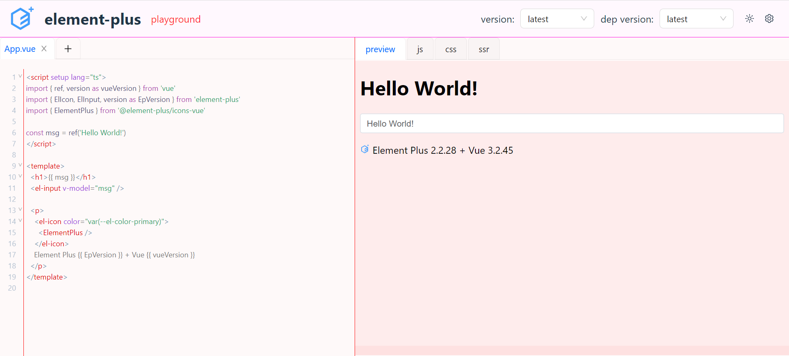

# 自定义主题变量

`ui-playground` 也只支持在一定程度上对主题颜色进行定制，它主要是通过 `CSS` 变量来实现的
## light
支持的`CSS` 变量如下：
```scss
// light
.play-ground{
  --bg-header: #fff;
  --color-branding-header: #42b883;
  --bg-container: #f8f8f8;
  --bg-toggler: #fff;
  --bg-preview: #fff;
  --text-light: #888;
  --font-code: -apple-system, BlinkMacSystemFont, 'Segoe UI', Roboto, Oxygen,
  Ubuntu, Cantarell, 'Open Sans', 'Helvetica Neue', sans-serif;
  --border: #ddd;
  --selector-h: 38px;
}
```
## dark
支持的`CSS` 变量如下：
```scss
// dark
.dark .play-ground {
  --bg-header: #1a1a1a;
  --color-branding-header: #89ddff;
  --bg-container: #242424;
  --bg-toggler: #1a1a1a;
  --bg-preview: #242424;
  --text-light: #aaa;
  --font-code: -apple-system, BlinkMacSystemFont, 'Segoe UI', Roboto, Oxygen,
  Ubuntu, Cantarell, 'Open Sans', 'Helvetica Neue', sans-serif;
  --border: #383838;
  --selector-h: 38px;
}
```

## 定制

编写你的样式主题 `SCSS` 文件

```scss
.play-ground {
  --bg-header: rgba(255, 211, 248, 0.17);
  --color-branding-header: #ff12df;
  --bg-container: rgba(250, 228, 228, 0.21);
  --bg-toggler: #ff1e1e;
  --bg-preview: rgba(255, 173, 173, 0.17);
  --text-light: #ff2d2d;
  --font-code: -apple-system, BlinkMacSystemFont, 'Segoe UI', Roboto, Oxygen,
  Ubuntu, Cantarell, 'Open Sans', 'Helvetica Neue', sans-serif;
  --border: #ff1212;
  --selector-h: 38px;
}
```

在项目的入口文件导入样式文件。
```javascript
// main.tsx
/* ... */
import '@ui-playground/theme/index'
import '..src/assets/custom-theme.scss'
/* ... */
```

最终效果如下:



:::info
如果你对支持的变量有其他需求，欢迎讨论 ([#github](https://github.com/baiwusanyu-c/ui-playground))
:::