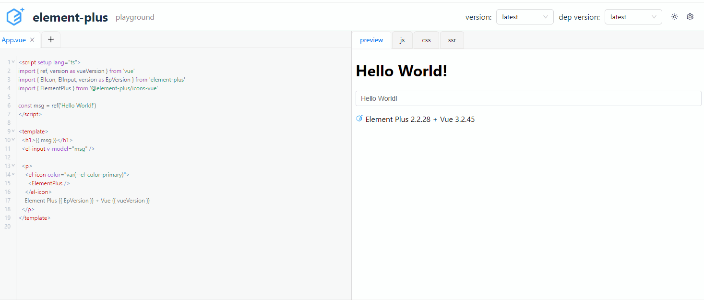

# Built-In Dark Theme

`ui-playgroun` 内置了黑暗主题，你可以通过配置选项，设置默认展示的主题风格

```javascript
import { getPlayPreset } from 'ui-playground'

export const demoConfig = () => {
  const config = getPlayPreset('vue')
  playConfig.headerOption.dark = true
  // config 将作为组件的props传递 <PlayGround config={demoConfig()} />
  return config
}
```


