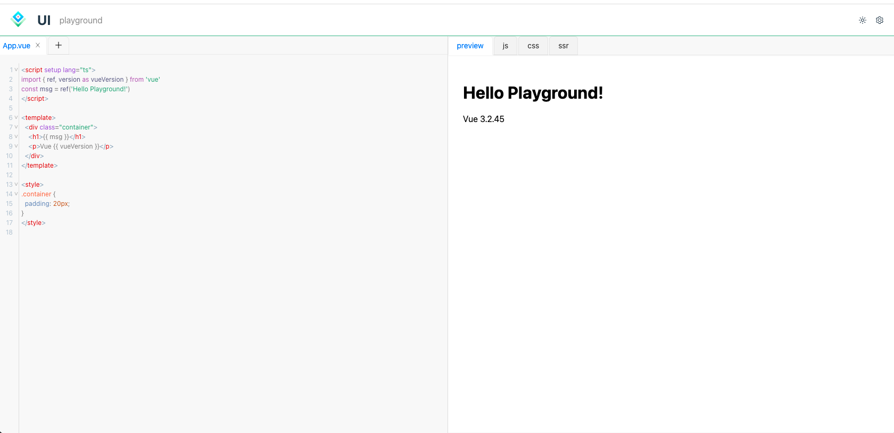

# 使用教程



## 创建一个 `react` 项目
以 `vite` 为例，快速创建一个 `react` 项目，用于承载你的 `play-ground`
````shell
pnpm create vite
✔ Project name: … my-playground
✔ Select a framework: › React
✔ Select a variant: › TypeScript

Scaffolding project in ...

Done. Now run:

  cd my-playground
  pnpm install
  pnpm run dev
````

## 引入样式
在入口文件中引入样式与主体
````shell
// src/main.ts
....
import '@ui-playground/theme/src/index.scss'
import '@ui-playground/theme/src/theme.scss'
....
````

## 初始化配置
`ui-playground` 内置了对 [`vue`](https://cn.vuejs.org/)的支持，你可以通过 `getPlayPreset` 获取并初始化配置
```javascript
import { getPlayPreset } from 'ui-playground'
export const demoConfig = () => {
  const config = getPlayPreset('vue')
  // config 将作为组件的props传递 <PlayGround config={demoConfig()} />
  return config
}
```

## 在组件中使用
获取初始化导出后的配置，并传入给组件 `PlayGround`
```javascript
// src/App.tsx
import { PlayGround } from 'ui-playground'
import { demoPu } from '../demoConfig.ts'
const playConfig = demoPu()
playConfig.isSSR = true
const App = () => {
    return (
        <div className="App">
            <PlayGround config={playConfig} />
        </div>
    )
}
export default App
```
